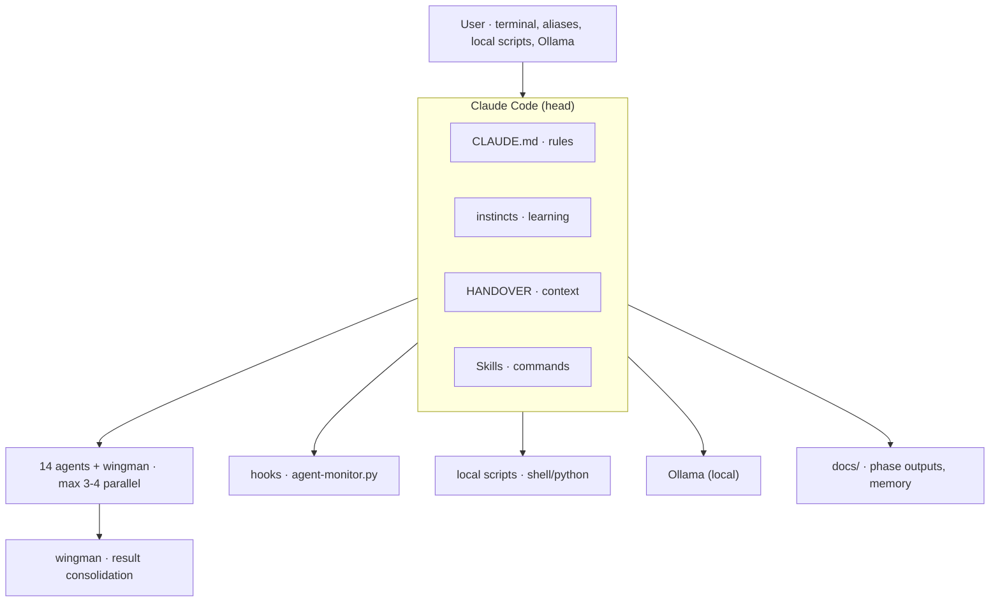

# Claude Code Agent System – System Documentation

Comprehensive documentation of the entire workflow, all processes, mechanisms, and infrastructure.
For the quick reference, see [WORKFLOW_CHEATSHEET.md](WORKFLOW_CHEATSHEET.md).

Last updated: 26.08.2026

---

## Table of Contents

1. [System Architecture](#1-system-architecture)
2. [Agent Team](#2-agent-team)
3. [Phase Model & Gates](#3-phase-model--gates)
4. [Command System](#4-command-system)
5. [Cross-Cutting Mechanisms](#5-cross-cutting-mechanisms)
6. [Monitoring & Hooks](#6-monitoring--hooks)
7. [Local Scripts](#7-local-scripts)
8. [Local LLM (Ollama)](#8-local-llm-ollama)
9. [Memory](#9-memory)
10. [Document Splitting (P3 + P6)](#10-document-splitting-p3--p6)
11. [Continuous Learning (Instincts)](#11-continuous-learning-instincts)
12. [File Structure](#12-file-structure)

---

## 1. System Architecture

### Overview

```
+-------------------------------------------------------------+
|                        User                                   |
|   Terminal: shell aliases, local scripts, Ollama              |
+----------+---------------------------------------------------+
           |
           v
+-------------------------------------------------------------+
|                     Claude Code (Head)                        |
|                                                               |
|  +----------+  +----------+  +----------+  +----------+     |
|  | CLAUDE.md|  |instincts |  |HANDOVER  |  | Skills   |     |
|  |(rules)   |  |(learning)|  |(context) |  |(commands)|     |
|  +----------+  +----------+  +----------+  +----------+     |
|                        |                                      |
|               +--------+--------+                             |
|               v        v        v                             |
|         +------+ +------+ +------+   14 agents +             |
|         |Agent | |Agent | |Agent |   1 wingman               |
|         |  A   | |  B   | |  C   |   (max 3-4 parallel)     |
|         +--+---+ +--+---+ +--+---+                           |
|            +--------+--------+                                |
|                     v                                         |
|              +----------+                                     |
|              | Wingman  |  Result consolidation               |
|              +----------+                                     |
+----------+---------------------------------------------------+
           |
     +-----+---------------------+
     v     v                     v
+--------+ +---------------+ +------------------+
| Hooks  | |Local Scripts  | | Ollama (local)   |
|(monitor)| |(shell/python) | | gemma3:4b        |
+--------+ +---------------+ +------------------+
```

GitHub-rendered view of the same mechanics:



### Control Layers

| Layer | File(s) | Purpose |
|---|---|---|
| **Configuration** | `~/.claude/CLAUDE.md` | Global rules, preferences, agent assignments |
| **Configuration** | `~/.claude/settings.json` | Hooks, permissions, default mode |
| **Knowledge** | `~/.claude/docs/*.md` | Reference documents (phases, commands, workflow) |
| **Learning** | `~/.claude/instincts.md` | Experience-based rules with confidence score |
| **Context** | `docs/HANDOVER.md` (per project) | Current work state for session transitions |
| **Automation** | `~/.claude/hooks/agent-monitor.py` | Monitoring, loop detection, warnings |
| **Token saving** | `~/.claude/scripts/` | Run mechanical tasks locally |
| **Token saving** | `~/.claude/scripts/local-llm/` | Delegate routine text tasks to local LLM |

---

## 2. Agent Team

13 domain subagents + `project-guide` + `wingman` = 15 agents. Max. 3-4 active per command.

### Agent Overview

| Agent | Specialization | Access |
|---|---|---|
| **project-guide** | Entry door: status snapshot, skill/agent recommendation, disambiguation, hand-off with context bundle (via `/guide`); does no domain work itself | Read + Edit |
| **konzeptor** | Product idea, target audience, features, MVP, value proposition | Read + Write |
| **business-analyst** | Business model, financial planning, pricing, market analysis, KPIs | Read + Write |
| **system-architekt** | Tech stack, data model, APIs, ADRs | Read + Write |
| **project-planner** | Milestones, sprints, backlog, prioritization | Read + Write |
| **ux-designer** | UI concepts, user flows, accessibility, dark mode | Read + Write |
| **senior-developer** | Implementation (TDD), clean code, feature development | Read + Write |
| **code-reviewer** | Code review, quality, best practices | **Read only** |
| **qa-tester** | Test strategy, test cases, exploratory tests, acceptance tests | Read + Write |
| **debugger** | Error analysis, root cause, systematic troubleshooting | Read + Write |
| **devops** | CI/CD, deployment, hosting (Hetzner), monitoring | Read + Write |
| **security-master** | Security strategy, DSGVO (GDPR), threat modeling, audits | Read + Write |
| **pentester** | Offensive security, finding vulnerabilities, PoCs | Read + Write |
| **tech-writer** | Documentation, README, API docs, changelogs | Read + Write |
| **wingman** | Result consolidation: summarize agent outputs | Read |

### Agent Definitions

Each agent has a Markdown file in `~/.claude/agents/` with:
- Role name and specialization
- Behavioral rules and constraints
- Output format specifications
- References to relevant docs

### Wingman Workflow

The wingman is not a regular agent, but a consolidation mechanism:

1. Parallel agents write full results to files
2. Each agent returns only a brief summary (max. 5 sentences)
3. Wingman reads the result files and creates a summary (max. 15 sentences)
4. Head-Claude presents the consolidated result to the user

**Token savings:** ~1000+ tokens per parallel agent run, because Head-Claude doesn't need all full results in context.

**Full chapter**: [system/agents.md](system/agents.md) — per-agent specialization, access levels, and the Wingman Workflow live there.

---

## 3. Phase Model & Gates

### Track Decision (Entry Point)

Every new project starts with `/track-decision`, which chooses between two parallel tracks:

```
/track-decision
     |
     +-- LEAN (Prototyp/PoC/Spike, 4 skills, no gates)
     |       |
     |       +-- /lean-frame -> [TDD build] -> /lean-learn
     |                                              |
     |                              +---------------+----------------+
     |                              |               |                |
     |                           PROMOTE         PIVOT             DROP
     |                              |               |                |
     |                       /lean-promote   /lean-frame        [repo frozen]
     |                              |       (re-frame or
     |                              |        hard reset)
     |                              v
     +----> FULL ---> /project-init -> /constitution -> /p0-problem -> ...
                                                         (P0-P8 full pipeline)
```

**Decision criteria** (see `/track-decision`): Knockouts K1-K5 (DSGVO PII, special categories, launch-imminent, BFSG/regulatory, external stakeholders) + Indicator Score I1-I5. Mid-flight re-assessment allowed; **no downgrade Full -> Lean**.

### Lean-Track Skills (4)

| Skill | Purpose |
|---|---|
| `/track-decision` | Lean vs Full decision (track-agnostic re-assessment tool) |
| `/lean-frame` | `docs/FRAME.md` + `docs/CLAUDE-lean.md` (one-page Single Source of Truth) |
| `/lean-learn` | `docs/LEARNINGS.md` + decision PROMOTE/PIVOT-soft/PIVOT-hard/DROP |
| `/lean-promote` | `docs/PROMOTION_BRIEF.md` as bootstrap input for `/project-init` |

### Full-Track Phase Overview

```
P0 Discovery --> P1 Conception <---> P2 Validation --> P3 Architecture
     |                |                    |                   |
     v                v                    v                   v
 [Gate 0]         [Gate 1]            [Gate 2]             [Gate 3]
                                                               |
P4 Planning --> P5 Implementation --> P6 Quality --> P7 Launch
     |            | <-- Sprint Loop --+       |              |
     v            v                    v       v              v
 [Gate 4]     [Gate 5]             [Gate 6]  [Gate 7]
                                                    |
                                          P8 Operations & Evolution
                                          | <-- Evolution Loop
                                          v    back to P1/P3/P5
```

### Phases in Detail

| Phase | Name | Lead Agent | Question | Gate Type |
|---|---|---|---|---|
| P0 | Discovery | Konzeptor | "Is it worth it?" | Go/No-Go |
| P1 | Conception | Konzeptor | "What are we building?" | Completeness Gate |
| P2 | Validation | Konzeptor | "Are the assumptions correct?" | Go/No-Go/Pivot |
| P3 | Architecture & Design | System-Architekt | "How do we build it?" | Completeness Gate |
| P4 | Planning | Project-Planner | "In what order?" | Readiness Gate |
| P5 | Implementation | Senior-Developer | "Let's build!" | Sprint Gate (repeated) |
| P6 | Quality Assurance | QA-Tester | "Is it stable?" | Approval Gate (QA + Security) |
| P7 | Launch & Deployment | DevOps | "Ship it!" | Go-Live Gate (Tech + Business) |
| P8 | Operations & Evolution | DevOps + Business-Analyst | "Is it running?" | Continuous |

### Iterative Loops

- **Validation Loop (P1 <-> P2):** Sharpen concept, validate, adjust
- **Sprint Loop (P5 <-> P6):** Implement, test, fix, next feature
- **Evolution Loop (P8 -> P1/P3/P5):** From operations back to earlier phases

### Gate Types

| Type | Meaning | Example |
|---|---|---|
| Go/No-Go | Binary decision: continue, stop, or pivot | Gate 0, Gate 2 |
| Completeness Gate | All defined results must be present | Gate 1, Gate 3 |
| Readiness Gate | Technical + organizational prerequisites met | Gate 4 |
| Sprint Gate | Repeated per sprint, checks implementation quality | Gate 5 |
| Approval Gate | Formal approval by QA and Security | Gate 6 |
| Go-Live Gate | Technical readiness + business readiness | Gate 7 |

### Gate Transitions

Gates are the only way to move to the next phase:

```
gate-p0 -> /p1-journeys
gate-p1 -> /p2-assumptions
gate-p2 -> /p3-architecture
gate-p3 -> /p4-backlog
gate-p4 -> /p5-implement (or /p4-sprint)
gate-p5 -> /p4-sprint (next sprint) or /p6-functional (all sprints done)
gate-p6 -> /p7-prepare
gate-p7 -> /p8-ops
```

Detailed gate checklists are in [PROJECT_PHASES.md](../docs/PROJECT_PHASES.md).

**Full chapter**: [system/phases-gates.md](system/phases-gates.md) — the full phase-by-phase table, iterative loops, and gate-type reference live there.

---

## 4. Command System

### Overview

- **82 phase commands** (P0: 3, P1: 5, P2: 4, P3: 23, P4: 4, P5: 12, P6: 22, P7: 5, P8: 4)
- **12 gates** (8 main gates + 4 sub-gates for P6/P7)
- **2 learning commands** (/postmortem, /instinct)
- **14 utility commands** (/konzept, /konzept-update, /decision, /epic, /user-stories, /roadmap, /roadmap-update, /project-init, /logs-summary, /guide, /release-baseline, /cleanup, /specialize, /anchor)
- **6 track + cross-cutting commands** (/track-decision, /constitution, /lean-frame, /lean-learn, /lean-promote, /cross-check)
- **Total: 116 commands**

### Naming Convention

```
/p[phase]-[section]     -> e.g. /p6-pentest
/gate-p[phase]          -> e.g. /gate-p0
/p[phase]-[sub-skill]   -> e.g. /p5-impl-red, /p6-audit-sast
```

### Sub-Skill Sequences

Within a phase there are fixed sequences. The most important:

**P3 Architecture** (branches after /p3-architecture):
```
/p3-architecture
    +-- p3-arch-components -> p3-arch-techstack -> p3-arch-adr -> p3-arch-nfa
    |
    +-- /p3-data-model
    +-- /p3-security
    |       +-- p3-sec-threats -> p3-sec-auth -> p3-sec-data -> p3-sec-api -> p3-sec-checklist
    +-- /p3-ux
    |       +-- p3-ux-navigation -> p3-ux-wireframes -> p3-ux-darkmode -> p3-ux-a11y
    +-- /p3-infra
    |       +-- p3-infra-hosting -> p3-infra-cicd -> p3-infra-monitoring -> p3-infra-teststrategy
    +-- /p3-cost
         -> gate-p3
```

**P5 Implementation** (TDD cycle per feature):
```
/p5-implement
    +-- p5-impl-red -> p5-impl-green -> p5-impl-refactor
         -> p5-review (p5-review-code -> p5-review-security)
              -> p5-acceptance (-> p5-bugfix on findings)
                   -> p5-docs
                        -> gate-p5
                             -> p5-polish (recommended cleanup)
                                  -> p4-sprint (next) OR p6-functional (all sprints done)
```

**P6 Quality Assurance:**
```
p6-functional (integration -> e2e -> regression)
    -> p6-exploratory
         -> p6-a11y (visual -> keyboard -> screenreader)
              -> p6-audit (sast -> auth -> deps -> config -> dsgvo)
                   -> p6-pentest (recon -> auth -> authz -> injection -> logic)
                        -> p6-bugfix
                             -> gate-p6 (gate-p6-qa + gate-p6-security)
```

### Next Steps Recommendations

After each command, Claude recommends 1-3 sensible next steps.
Rules:
1. HANDOVER.md determines the current phase state
2. Never skip phases – no P5 command if Gate-P4 has not been passed
3. Follow sub-skill sequences
4. Gates are authoritative – only gates open the way to the next phase

Full transition reference: [NEXT_STEPS_REFERENCE.md](../docs/NEXT_STEPS_REFERENCE.md)
All commands in detail: [SECTIONS_COMMANDS.md](SECTIONS_COMMANDS.md)

**Full chapter**: [system/commands.md](system/commands.md) — the command-count breakdown, naming convention, and full sub-skill sequence diagrams for P3/P5/P6 live there.

---

## 5. Cross-Cutting Mechanisms

### Constitution (`docs/CONSTITUTION.md`)

Mandatory artifact for every Full-Track project — the project's "constitution"
with three sections that gates load as binding input:

- **Inviolable** (non-negotiable): DSGVO, BFSG/A11y baseline, sectoral compliance, architecture guardrails from "inviolable"-tagged ADRs
- **Default** (deviate with justification): tech stack, TDD discipline, language, platform targets, monetization pattern
- **Aspirational** (goals, measured): test coverage threshold, performance budget, A11y-audit quality, user-research minimum

**Creation** via `/constitution` in three modes:
- **Greenfield**: 5 domain bootstraps available (`saas-b2c`, `mobile-b2c`, `b2b-tool`, `b2c-marketplace`, `on-device-privacy`)
- **Lean pre-run**: reads Constitution-Light from `docs/FRAME.md` Section 6
- **Existing Full-Track**: drafts from existing phase docs (ADRs, REGULATORY.md, A11Y.md, SECURITY.md, NFR.md)

**Versioning**: Semver-light. MINOR-bump for Default/Aspirational changes, MAJOR-bump for Inviolable changes (requires ADR).

**Gate integration**: `gate-preflight.py` extracts the Inviolable section into `docs/.gate-preflight-pX.md`. All 8 gate commands (P0-P7) load it as mandatory pre-gate input. Inviolable violations are flagged as **"Inviolable breach"** = No-Go signal in the verdict.

### Cross-Check (`/cross-check`)

Optional pre-gate consistency check across phases. 7 initial rules:

| # | Rule |
|---|---|
| R1 | FEATURES.md <-> AUTH.md (each user-facing feature has an auth flow) |
| R2 | TECH_STACK.md <-> DATA_MODEL.md (DB choice consistent with schema syntax) |
| R3 | THREATS.md <-> AUTH/SECURITY (each threat has a mitigation) |
| R4 | NFR.md <-> TESTSTRATEGY.md (each NFR has a test approach) |
| R5 | ADR-status <-> Components (rejected ADRs not actively referenced) |
| R6 | CONSTITUTION Inviolable <-> ADRs/Implementation (no ADR violates Inviolables) |
| R7 | STORY_INDEX <-> Epic-Detail-Files (bidirectional story-epic consistency) |

**Output**: `docs/.cross-check-report.md` (volatile, regenerated per run).
**Recommendation, not mandatory** — gates list `/cross-check` as a suggested pre-step. Iterative rule expansion expected.

### Anchored State Verification (`/anchor`)

> Shipped since `v0.3.0-beta` — see [system/anchored-state.md](system/anchored-state.md).

Where `/cross-check` compares Markdown to Markdown, `/anchor` compares a phase document's
recorded `anchor_commit`/`anchor_date` frontmatter against the repository's actual git
history — docs-vs-implementation drift, the gap `/cross-check`'s R6 rule names but never
closes (its own source list contains no code). Two stages:

| Stage | Does | Produces |
|---|---|---|
| 1 — mechanical (`anchor status`/`check`) | anchor vs. last **production-code** commit (exclusion-based: not under `docs/`, not under `.claude/`, not `*.md`, configurable via `.claude/settings.json`) | data — always exit 0, staleness is never itself a verdict |
| 2 — agent, scoped to the delta only | "does this delta invalidate a statement in this document?" | severity, read from the affected document's **own** `status` (`living` info · `active`/`frozen` warning/error + work item) |

The anchor lives on the **phase index**, written by the Gate-Go freeze hook; documents
under that scope inherit it unless they opt into their own (typically alongside
`covers:`). `anchor ack` acknowledges drift deliberately — never a side effect of another
command, and never run by an agent (a prevention clause, backed by a per-run
"N anchored · M asserted without doc change · K stale" statistic as detection, since no
hard technical boundary stops a scripted call).

**Design**: `docs/adr/ADR-0009-anchored-state-verification.md` (incl. both addenda).
**Full chapter**: [system/anchored-state.md](system/anchored-state.md).

### Conformance Runs Against Consumers (`conformance-run.sh`)

> Not yet in any tagged release — see [system/conformance.md](system/conformance.md).

Runs this repository's own shipped checks (the lints, the anchor mechanism) against
real projects that consume them, as part of this repository's own verification —
a check tested only against its own repository's fixtures is a hypothesis, not a
proof. Every finding is sorted into exactly one of four classes:

| Class | Meaning | CCPR-attributable? |
|---|---|---|
| C1 — contract violation | The check's own behaviour disagrees with what it documents about itself | yes |
| C2 — zero scope | `Files scanned: 0` over a target an independent probe shows is non-empty | yes |
| C3 — pinned expectation violated | A configured, per-consumer, dated expectation (with a mandatory `why`) disagrees with the check's output | yes |
| P — consumer finding | A real finding in the consumer's own documents | no — reported, never escalates the exit code |

A check that refuses an unsuitable target (no git repo, no `docs/`) is reported as
`Could Not Run`, its own fifth heading — neither a contract violation nor a
consumer finding, but never allowed to look like a silent clean pass either.

Consumers are declared as **local filesystem paths only** (nothing is fetched over
a network) in the same personal, non-distributed config `artifact-gate.sh` and
`memory-sync.sh` already read (`~/.claude/memory-sync.json`, `conformance` key).
Not-configured is exit 0 with a loud stderr statement, never a silent pass;
`--require-consumers` turns an empty consumer list into a finding instead.

**Design**: `docs/adr/ADR-0010-conformance-runs-against-consumers.md` (incl. Addendum 1).
**Full chapter**: [system/conformance.md](system/conformance.md).

### Handover (HANDOVER.md)

Preserves work state across session transitions. Located in `docs/HANDOVER.md` in the project directory.

**Session Start:**
1. Check if `docs/HANDOVER.md` exists
2. If yes: read it and continue work

**Session End / Before Compact:**
- Update HANDOVER.md with current work state
- Template: `~/.claude/templates/HANDOVER_TEMPLATE.md`

**Strategic Compact:**
1. At 100 tool calls: Compact reminder (via agent-monitor)
2. At 150 tool calls: Urgent HANDOVER warning
3. **Before** /compact: Update HANDOVER.md
4. **After** /compact: Read HANDOVER.md to restore context

### Wingman Consolidation

See [Agent Team > Wingman Workflow](#wingman-workflow).

Commands that use the wingman: `/konzept`, `/p1-features`, `/gate-p1`, `/p3-architecture`, `/gate-p3`, `/p5-review` and other commands with parallel agents.

### Token Optimization

Multiple mechanisms work together:

| Mechanism | Token Savings | How |
|---|---|---|
| Wingman consolidation | ~1000+ per agent run | Summary instead of full results in context |
| Local scripts | variable | Mechanical checks outside of Claude |
| Ollama delegation | ~500-1000 per call | Summaries, HANDOVER drafts locally |
| Strategic compact | significant | Context compression on long sessions |
| Agent brief summaries | ~500 per agent | Agents return max. 5 sentences |

**Full chapter**: [system/cross-cutting.md](system/cross-cutting.md) — Constitution, Cross-Check, Handover, Wingman Consolidation and Token Optimization live there in full; Anchored State Verification has its own chapter, linked above.

---

## 6. Monitoring & Hooks

### Hook Architecture

A central Python script (`~/.claude/hooks/agent-monitor.py`) processes all hook events.

**Registered events (in settings.json):**

| Event | When | What the monitor does |
|---|---|---|
| `SessionStart` | Claude session starts | Create fresh loop state, start logging |
| `SessionEnd` | Session ends | Write summary, log incomplete agents, clean up state |
| `PreToolUse` | Before every tool call | Loop detection, tool count, stagnation check |
| `PostToolUse` | After every tool call | Performance tracking (duration) |
| `SubagentStart` | Agent is started | Record start time, duplicate batch detection |
| `SubagentStop` | Agent finishes | Calculate duration, slow agent warning |

### Loop Detection

Detects and blocks infinite loops:

```
Same tool call 3x -> Warning (log)
Same tool call 5x -> BLOCKED (exit 2, feedback to Claude)
```

Additionally:
- EISDIR pattern: 3x "Is a directory" error -> Warning
- Duplicate batch: Same agent set started again within 30 min -> Warning

### Tool Count Warnings

| Threshold | Action |
|---|---|
| 100 tool calls | Compact reminder (stderr -> Claude) |
| 150 tool calls | Token budget warning + update HANDOVER |
| 200 tool calls | High tool count in error log |
| 500 tool calls | Critical tool count in error log |

### Stagnation Detection

When no `Write` or `Edit` is executed for 15 minutes:
- Warning to Claude: "Stuck? Consider rethinking approach or asking user."
- Resets once a productive tool call occurs again

### Slow Agent Warning

When an agent runs longer than 10 minutes -> Warning to Claude via stderr.

### Input Validation

Certain tool inputs are validated before execution:
- `AskUserQuestion`: Every question needs 2-4 options. Invalid calls are blocked.

### Log Files

```
~/.claude/logs/
+-- activity.jsonl          # Aggregated activity log (rotates at 10MB)
+-- errors.jsonl            # Aggregated error log (rotates at 10MB)
+-- performance.jsonl       # Aggregated performance log (rotates at 10MB)
+-- sessions/
    +-- {session_id}/
        +-- activity.jsonl   # Session-specific
        +-- errors.jsonl     # Session-specific
        +-- performance.jsonl# Session-specific
        +-- session-summary.json  # Summary at SessionEnd
```

**Loop state:** `/tmp/claude-loop-{session_id}.json` (temporary, deleted at SessionEnd)

### Log Analysis

The script `logs-summary.py` analyzes the logs:
```bash
~/.claude/scripts/logs-summary.py errors        # Show errors
~/.claude/scripts/logs-summary.py performance   # Performance data
~/.claude/scripts/logs-summary.py agents        # Agent statistics
~/.claude/scripts/logs-summary.py loops         # Loop events
~/.claude/scripts/logs-summary.py all           # Everything
```

Periods: `today`, `week`, `all`

**Full chapter**: [system/monitoring-scripts.md](system/monitoring-scripts.md) — the full hook architecture, loop detection, and log-file layout live there.

---

## 7. Local Scripts

Shell and Python scripts in `~/.claude/scripts/` for mechanical tasks.
Save Claude tokens because they run outside the session.

> Editing one of these scripts (in the repo's `scripts/`, not the installed
> `~/.claude/scripts/` copy)? Two conventions are enforced by tests before a
> change ships — see [system/scripts-conventions.md](system/scripts-conventions.md).

### Before Session Start

| Script | Usage | Result |
|---|---|---|
| `bootstrap.sh` | `~/.claude/scripts/bootstrap.sh [projectdir]` | `docs/.session-context.md` – Git status, HANDOVER, artifacts, instincts |
| `gate-preflight.py` | `~/.claude/scripts/gate-preflight.py p3 [projectdir]` | `docs/.gate-preflight-p3.md` – Artifacts, content patterns, Ollama summaries |
| `command-check.py` | `~/.claude/scripts/command-check.py p5-implement [projectdir]` | Stdout: ready/blocked with reason |

Claude reads generated files (if < 10 min old) automatically as compact context.

### During Work

| Script | Usage | Result |
|---|---|---|
| `run-tests.sh` | `~/.claude/scripts/run-tests.sh [testpath] [projectdir]` | JSON output (detects pytest/jest/vitest/cargo/go) |
| `quality-scan.sh` | `~/.claude/scripts/quality-scan.sh [scope] [projectdir]` | `docs/.quality-scan-report.json` |

Scopes for quality-scan: `all`, `deps`, `sast`, `config`, `dsgvo`

### One-Time / As Needed

| Script | Usage | Purpose |
|---|---|---|
| `project-init.sh` | `~/.claude/scripts/project-init.sh name [template]` | Project scaffolding (default/webapp/api/library) |
| `logs-summary.py` | `~/.claude/scripts/logs-summary.py [focus] [period]` | Analyze session logs |
| `setup-ollama.sh` | `~/.claude/scripts/setup-ollama.sh` | Install Ollama + gemma3:4b, generate wrapper scripts |
| `instinct-check.sh` | `~/.claude/scripts/instinct-check.sh` | Check instinct decay (no LLM needed) |
| `memory-sync.sh` | `~/.claude/scripts/memory-sync.sh pull\|promote\|gate\|status` | Sync a shared org-tier memory/instincts repo into `~/.claude` (read-only overlay); share local entries via a discipline gate. Details: [system/memory-instincts.md → Team Sharing (Org Tier)](system/memory-instincts.md) |

### Doc Hygiene & Validation

Five read-only validators, all non-zero on findings: `memory-lint.sh` (memory schema,
cross-refs, index consistency, age, size caps), `phase-docs-lint.sh` (phase-doc
frontmatter — **scoped by folder name**, so `Files scanned: 0` means it looked at
nothing, not that it passed), `manual-lint.sh` (a documentation index↔detail contract:
`parent_index`, the back-link, `kind` — run by `/cleanup`), `doc-volume-check.sh` (size:
info 25–40 KB, warning 40–50, error ≥50) and `instinct-check.sh` (decay, no LLM).

### State, Baselines & Migration

`anchor.sh` behind `/anchor` (stage-1 mechanical, no verdict) · `freeze-phase-docs.sh`
(`frozen` after a Gate-Go, from `draft`/`active` only; P5 and P8 no-ops) · `baseline.sh`
(`<version>` required, writes `docs/.baseline-prep.md`) · `workitems.py` (CLI dispatcher,
ADR-0002, default backend `local` — see [WORKITEMS.md](WORKITEMS.md)) ·
`migrate-review-headers.sh` (one-off, idempotent header backfill) · `log-cleanup.sh`
(trims `~/.claude/logs/`, default 7 days; triggered at `SessionStart`, once a day) · `artifact-gate.sh` (secret / personal-data /
deny-list sweep over tracked files, Constitution Inviolable — shipped since
**`v0.3.0-beta`**, details: [system/discipline-gate.md](system/discipline-gate.md)).

**Every one of these, with its full usage line and exit-code contract, lives once in
[system/monitoring-scripts.md](system/monitoring-scripts.md)** — the index names them so
you know they exist, not so you can look them up here.

### Shared Libraries

Python and shell modules in `~/.claude/scripts/lib/`:
- `next_steps.py` – Phase-to-commands mapping, HANDOVER.md parser
- `artefacts.py` – Phase-to-expected-files mapping
- `gate_checklists.py` – Gate checklists with required sections + content pattern checks (regex)
- `discipline_gate.sh` – shared secret/personal-data/deny-list pattern library, sourced by `artifact-gate.sh` and `memory-sync.sh promote` — see [system/discipline-gate.md](system/discipline-gate.md)

### Shell Aliases

Configured in `~/.zshrc`:

```
cb        -> bootstrap.sh + start Claude
cgate     -> gate-preflight.py
ctest     -> run-tests.sh
ccheck    -> command-check.py
cscan     -> quality-scan.sh
clogs     -> logs-summary.py
cmsg      -> commit-msg.sh (Ollama)
cinstinct -> instinct-check.sh
```

### How Claude Uses the Scripts

Claude automatically detects generated files and uses them as context:
- `docs/.session-context.md` (< 10 min old) -> reads instead of HANDOVER + git + instincts individually
- `docs/.gate-preflight-pX.md` (< 10 min old) -> uses as gate basis, focuses on content
- `docs/.quality-scan-report.json` -> uses as basis for /p6-audit and /p6-pentest

**Full chapter**: [system/monitoring-scripts.md](system/monitoring-scripts.md) — the full script catalogue, shared libraries, and shell-alias reference live there. Editing conventions: [system/scripts-conventions.md](system/scripts-conventions.md).

---

## 8. Local LLM (Ollama)

### Setup

- **Framework:** Ollama (CLI-first, OpenAI-compatible API)
- **Model:** gemma3:4b (~3.3GB, Google Gemma 3)
- **Server:** runs as brew service (`brew services start ollama`)
- **API:** `http://localhost:11434` (Generate API with stream=false)

### Wrapper Scripts

Located in `~/.claude/scripts/local-llm/`:

| Script | Purpose | Caller |
|---|---|---|
| `ollama-query.sh` | Shared helper – sends prompt to Ollama Chat API | Internal (from other scripts) |
| `summarize.sh <file>` | Summarize file in 3-5 sentences | Claude or user |
| `handover-draft.sh [dir]` | HANDOVER.md draft from git status | Claude or user |
| `commit-msg.sh` | Commit message from staged diff | Claude, user, or git hook |
| `install-git-hook.sh <dir>` | Install prepare-commit-msg hook | User (one-time per project) |

### Token Delegation by Claude

Claude delegates routine tasks to Ollama when the server is reachable:

**Delegate:**
- Long file summaries -> `summarize.sh`
- HANDOVER drafts -> `handover-draft.sh` as starting point, then refine
- Commit messages -> get `commit-msg.sh` suggestion

**Don't delegate:**
- Architecture decisions, code reviews, security analyses
- Anything that requires judgment

**Fallback:** If Ollama is not reachable, Claude handles the task itself.

### Git Hook (optional)

`install-git-hook.sh` installs a `prepare-commit-msg` hook:
- On every `git commit`, a message is automatically suggested
- The suggestion appears in the editor and can be overwritten
- Skipped on merge, amend, squash, or when Ollama is not running

### Technical Details

- gemma3:4b responds directly without thinking overhead (~12s per summary)
- `num_predict: 512` is sufficient for summaries and commit messages
- Generate API (`/api/generate`) for simple prompt-response
- `stream: false` for script usage (no spinner, no ANSI)
- Previous model qwen3.5 (14B) was too large for 24GB M4 (22 min per summary)
- qwen3:4b had thinking problem (empty content, output only in thinking field)

### Gate Preflight Integration

`gate-preflight.py` uses Ollama automatically for document summaries:
- Per gate artifact, `summarize.sh` is called (3-5 sentences per document)
- Summaries end up in the preflight report under "Document Summaries"
- Timeout: 90s per file. On timeout or Ollama failure: section is omitted
- Saves ~16k tokens per gate run (agent reads summaries instead of raw documents)

**Full chapter**: [system/monitoring-scripts.md](system/monitoring-scripts.md) — setup, wrapper scripts, and the git-hook detail live there.

---

## 9. Memory

### Concept

Memory is factual knowledge Claude carries between sessions, organised as a **2×2
matrix**: two tiers (cross-cutting vs. persona-specific) × two scopes (global vs.
project). The four slots coexist on purpose — a rule about this codebase and a rule about
a language's idioms do not belong in the same file.

|  | **Tier 1 — cross-cutting** | **Tier 2 — persona-specific** |
|---|---|---|
| **Global** (`~/.claude/`) | `instincts.md` (slim index) + `instincts/{theme}.md` + `instincts-archive/HISTORY.md` | `memory/{agent}/instincts.md` (+ topic files) |
| **Project** (`docs/memory/`) | `{type}_{slug}.md` (flat) | `{agent}/MEMORY.md` + topic files |

Project-scoped memory is versioned in the project repository and pushable; global memory
stays in personal global storage and is never pushed — `type: user` never leaves it.

**Tier-separation rule** — cross-cutting → Tier 1; persona-specific → Tier 2.
**When in doubt, do not default to Tier 1**: the earlier "visibility wins over isolation"
tiebreaker was reversed after it drifted persona-specific patterns into the global file.

Required frontmatter is `name`, `description`, `type`, `last_updated`; a Tier-2-global
file additionally carries `scope: tier-2-global` and `agent: <name>`. The `type`
vocabulary is a **closed enum in Tier 1 and deliberately open in Tier 2**, so an
unforeseen persona label warns rather than fails.

`memory-lint.sh` validates all of it — schema, naming, `related:` cross-references, index
consistency in both directions, age, and the size caps on the global instinct files.
`memory-sync.sh` shares entries with a team through a read-only overlay and a discipline
gate (§7).

**Full chapter**: [system/memory-instincts.md → Memory](system/memory-instincts.md) — the
type table, the full frontmatter block, the index conventions, the check-by-check lint
list, the template catalogue and the org-tier sharing protocol live there.
Schema: `templates/MEMORY_SCHEMA.md`.

---

## 10. Document Splitting (P3 + P6)

### Concept

Phases P3 and P6 produce many concerns at once, and a single monolithic phase document
bloats past 30–50 KB. The answer is a **two-level pattern**: a slim phase index plus one
detail file per sub-skill.

The index (`docs/<phase>/<PHASE>.md`, 5–15 KB) carries state, key decisions and pointers;
each sub-skill owns one detail file beside it; P3 and P6 add a sub-index level that groups
several detail files under one lead command.

Each `/pX-…` sub-skill **overwrites** its detail file (never appends), then refreshes the
index row and lifts any one-line key decision or risk into the index. Gate commands read
the index first and pull a detail file only when a content check demands it — that is what
keeps a gate's context window small.

Required frontmatter is `phase` (P0..P8), `subskill`, `status`, `last_updated`, with
`status` one of `skeleton | draft | active | frozen | archived | living`. Phase docs have
**no stale detection**: unlike memory, `frozen` is a wanted end state, not a warning.
`phase-docs-lint.sh` validates the schema; `doc-volume-check.sh` watches size (info at
25–40 KB, warning at 40–50, error at ≥50).

**Full chapter**: [system/memory-instincts.md → Document Splitting](system/memory-instincts.md)
— the worked P3/P6 examples, the status semantics table and the per-check validation list
live there. Schema: `templates/PHASE_DOC_SCHEMA.md`.

---

## 11. Continuous Learning (Instincts)

### Concept

Instincts are behavioural rules with a confidence score (0.3–0.9), mined from session
experience by `/postmortem` and confirmed or contradicted over time. Memory is *what is
true*; an instinct is *how to work*. Claude follows one proportionally to its confidence.

### Four scopes

Instincts sit in the same 2×2 as memory (§9), so there are **four** instinct files, not
three: global Tier 1 (`~/.claude/instincts.md` + `instincts/{theme}.md` +
`instincts-archive/HISTORY.md`), global Tier 2 (`~/.claude/memory/{agent}/instincts.md`),
project Tier 1 (`docs/instincts.md`) and project Tier 2
(`docs/memory/{agent}/instincts.md`). A subagent reads all four layers that apply to it;
on conflict the more specific wins (project over global, Tier 2 over Tier 1).

**ID schema**: `G-NNN` global Tier 1 · `{prefix}-G-NNN` global Tier 2 (`SD-G-001`,
`DV-G-001`, …) · `SD-NNN` / `QA-NNN` / … project Tier 2. A namespaced overlay from another
contributor or a shared org tier keeps its own prefix, so nothing collides on re-sync.

**Lifecycle**: `/postmortem` proposes; `/instinct add|confirm|reject|promote|cleanup`
maintains; `instinct-check.sh` reports age and decay candidates without an LLM.

**Full chapter**: [system/memory-instincts.md → Continuous Learning](system/memory-instincts.md)
— the entry format, the confidence arithmetic with its source of truth per row, and the
command-by-command effects live there.

---

## 12. File Structure

### Global Configuration (~/.claude/)

```
~/.claude/
+-- CLAUDE.md                    # Global rules and preferences
+-- settings.json                # Hooks, permissions
+-- instincts.md                 # Global instincts
|
+-- agents/                      # 13 domain + project-guide + wingman = 15
|   +-- konzeptor.md
|   +-- business-analyst.md
|   +-- system-architekt.md
|   +-- project-planner.md
|   +-- ux-designer.md
|   +-- senior-developer.md
|   +-- code-reviewer.md
|   +-- qa-tester.md
|   +-- debugger.md
|   +-- devops.md
|   +-- security-master.md
|   +-- pentester.md
|   +-- tech-writer.md
|   +-- project-guide.md
|   +-- wingman.md
|
+-- docs/                        # Runtime reference docs (read by Claude during work)
|   +-- PROJECT_PHASES.md        # Phase model with gate checklists
|   +-- NEXT_STEPS_REFERENCE.md  # Transition reference for recommendations
|   +-- CONSTITUTION.md          # CCPR's own ratified constitution
|   +-- adr/                     # Architecture Decision Records
|   +-- memory/                  # Project memory (MEMORY.md index + project_*.md)
|
|   # Human-facing manual (this document) lives in the repo's Manual/ — not installed
|
+-- hooks/
|   +-- agent-monitor.py         # Central monitoring script
|
+-- scripts/
|   +-- bootstrap.sh             # Pre-session context gathering
|   +-- gate-preflight.py        # Check gate artifacts
|   +-- command-check.py         # Check command prerequisites
|   +-- run-tests.sh             # Tests with JSON output
|   +-- quality-scan.sh          # Security/quality scans
|   +-- project-init.sh          # Project scaffolding
|   +-- logs-summary.py          # Log analysis
|   +-- setup-ollama.sh          # Ollama + model setup
|   +-- instinct-check.sh        # Check instinct decay
|   +-- lib/                     # Shared Python libraries
|   |   +-- next_steps.py
|   |   +-- artefacts.py
|   |   +-- gate_checklists.py
|   +-- local-llm/               # Ollama wrapper scripts
|       +-- ollama-query.sh      # Shared helper (API call)
|       +-- summarize.sh         # Summarize file
|       +-- handover-draft.sh    # HANDOVER draft
|       +-- commit-msg.sh        # Commit message
|       +-- install-git-hook.sh  # Git hook installer
|
+-- logs/                        # Monitoring logs
|   +-- activity.jsonl
|   +-- errors.jsonl
|   +-- performance.jsonl
|   +-- sessions/{session_id}/
|
+-- templates/
    +-- HANDOVER_TEMPLATE.md     # Handover template
```

### Per Project (docs/)

```
my-project/
+-- .claude/
|   +-- CLAUDE.md                # Project-specific rules
|
+-- docs/
|   +-- HANDOVER.md              # Handover (work state)
|   +-- SPRINT.md                # Current sprint
|   +-- instincts.md             # Project-specific instincts
|   |
|   |  # Phase artifacts (examples)
|   +-- DISCOVERY.md
|   +-- CONCEPT.md
|   +-- FEATURES.md
|   +-- MVP.md
|   +-- BUSINESS_MODEL.md
|   +-- VALIDATION.md
|   +-- ARCHITECTURE.md
|   +-- SECURITY.md
|   +-- INFRASTRUCTURE.md
|   +-- PROJECT_PLAN.md
|   +-- BACKLOG.md
|   +-- ...
|   |
|   |  # Lean-Track artifacts (only if track = lean)
|   +-- TRACK_DECISION.md       # /track-decision output
|   +-- CONSTITUTION.md         # /constitution (optional in Lean, mandatory in Full)
|   +-- FRAME.md                # /lean-frame Single Source of Truth
|   +-- CLAUDE-lean.md          # slim CLAUDE for Lean (replaces .claude/CLAUDE.md)
|   +-- LEARNINGS.md            # /lean-learn validation + decision
|   +-- PROMOTION_BRIEF.md      # /lean-promote bridge to Full-Track
|   +-- lean-archive/           # archived FRAME/LEARNINGS/CLAUDE-lean after promotion or pivot
|   |
|   |  # Generated files (in .gitignore)
|   +-- .session-context.md
|   +-- .gate-preflight-pX.md
|   +-- .quality-scan-report.json
|   +-- .cross-check-report.md
|   +-- .baseline-prep.md
|
+-- ...
```

**Full chapter**: [system/file-structure.md](system/file-structure.md) — the full directory trees for both the global (`~/.claude/`) and per-project layouts live there.

---

## Change History

| Date | Change |
|---|---|
| 06.03.2026 | Initial creation; Ollama integration (qwen3.5), instinct-check.sh, install-git-hook.sh |
| 06.03.2026 | Ollama model: qwen3.5 -> gemma3:4b (performance: 22 min -> 12s). Gate preflight: content patterns + Ollama summaries. gate-p4: Preflight-centered, 1 agent instead of 2 (~60% token savings). Command count: 103 commands (80 phase + 12 gates + 2 learning + 9 utility) |
| 13.05.2026 | Lean-Track introduced (parallel to Full-Track): /track-decision entry point, /lean-frame + /lean-learn + /lean-promote (4 skills, no gates). Constitution as mandatory Full-Track artifact: /constitution skill (Hybrid mode with 5 domain bootstraps), gate-preflight.py extracts Inviolables, all 8 gates load them as binding input. /cross-check as optional pre-gate consistency check (7 initial rules). 6 new commands, 6 new templates + 5 bootstraps. Command count: 109 -> 115. |
| 20.08.2026 | Documented `memory-sync.sh` (org-tier memory/instincts sharing, shipped since v0.2.0-beta) and the discipline gate (`artifact-gate.sh` + `lib/discipline_gate.sh` + CI template) — none of the three had appeared anywhere under `Manual/` before. New detail page `system/discipline-gate.md`; `system/memory-instincts.md` gained a "Team Sharing (Org Tier)" subsection. The discipline gate itself is **not yet in any tagged release** (absent from `v0.2.1-beta`) — noted at every mention. |
| 21.08.2026 | Documented anchored state verification (`/anchor`, `scripts/anchor.sh`, ADR-0009) — checks phase documents against the code they describe rather than against other documents, closing the gap `/cross-check`'s R6 rule names but never closes. New detail page `system/anchored-state.md`; new "Anchored State Verification (`/anchor`)" subsection alongside Cross-Check in §5. `/anchor` is **not yet in any tagged release** (absent from `v0.2.1-beta`) — noted at every mention. Command count 115 → 116 (Utility 13 → 14). |
| 26.08.2026 | Added the 7 missing "Full chapter" pointers to `system/agents.md`, `phases-gates.md`, `commands.md`, `cross-cutting.md`, `monitoring-scripts.md` (linked from §6, §7 and §8 — the one detail file spans all three index sections), `scripts-conventions.md` and `file-structure.md`, making the "slim index → detail files" README claim true for both `SYSTEM_OVERVIEW.md` and `SECTIONS_COMMANDS.md`. `SECTIONS_COMMANDS.md`'s per-section command tables (108 rows byte-identical to `commands/*.md`, 8 worded differently, `/p5-review-sprint` present only here) were replaced by orientation paragraphs + pointers after reconciling the 8 divergent rows against the source `commands/*.md` files and adding the missing command to `commands/phases.md`. |
| 26.08.2026 (2) | Finished the index/chapter split for §9 Memory, §10 Document Splitting and §11 Instincts — they were **copies** of `system/memory-instincts.md`, not summaries of it, and §11 had drifted: three instinct levels where the model has four scopes, global Tier 2 missing entirely, ID schema without `{prefix}-G-NNN`. §9 said "Two-tier" for a 2×2 model. The copies were **not** re-synced; each surviving claim was checked against its source instead, which found three places where both copies agreed and neither matched the code (memory `type` missing `index`/`patterns`; a new instinct starts at 0.4, not "0.4-0.5"; the `doc-volume` band labels). Those are fixed in the chapter, now the single copy. Full detail: `CHANGELOG.md`, `v0.3.0-beta`. |
| 26.08.2026 (3) | Release-readiness pass for `v0.3.0-beta`. `system/monitoring-scripts.md` calls itself the full script catalogue and was missing **10 of 20** shipped scripts, three of which (`baseline.sh`, `manual-lint.sh`, `migrate-review-headers.sh`) appeared nowhere in `Manual/` or the README at all. Two new groups added there; §7 names them and points rather than copying. Every row was written from the script's own header, correcting five drafts. The "Not Yet Released" sections and both "not shipped in any tagged release yet" banners were resolved — the tag makes them false. The test suite is now named in `README.md` and `Manual/README.md`, with its required `-t .`. Full detail: `CHANGELOG.md`, `v0.3.0-beta`. |
